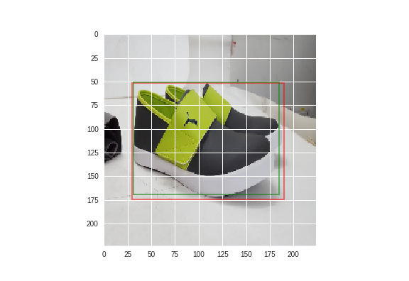

# ObjectLocalizer
An object localizer made for the Flipkart grid ML challenge. We achieved 86% accuracy(approx), and had a rank of 124 in the contest.

## Getting Started
These notbooks were made and imported from Google Colab. The following notebooks would run as it is in colab. To run the same in your own machine, download the datasets into a directory and provide and change the path variable to that directory and you are good to go.

## Dataset
Link to the Google drive link for the train dataset :- https://drive.google.com/open?id=1NsrEIkevefVZ0hlYfE1Qw6GnPHww5jg7
Link to the Google drive link for the test dataset :- https://drive.google.com/open?id=1pYBoAE5-35s8So9agyh3qMOGUeR0dINe

Use the image names in the CSV files in the repository to access the images.

## Example

## HOW TO RUN

Run the cells in the DatMan.ipynb file. This file takes 3500 images from the training dataset and stores it as a .np file.
Use this file in the FChal2.ipynb file, to train the model and save the model.
Using this saved model, generate a .csv file using the TestGenerator.ipynb.

In order to check your predictions on the images itself, run the designated cells in the FChal2.ipynb file.

The code, in particular was tested in the steps given above
